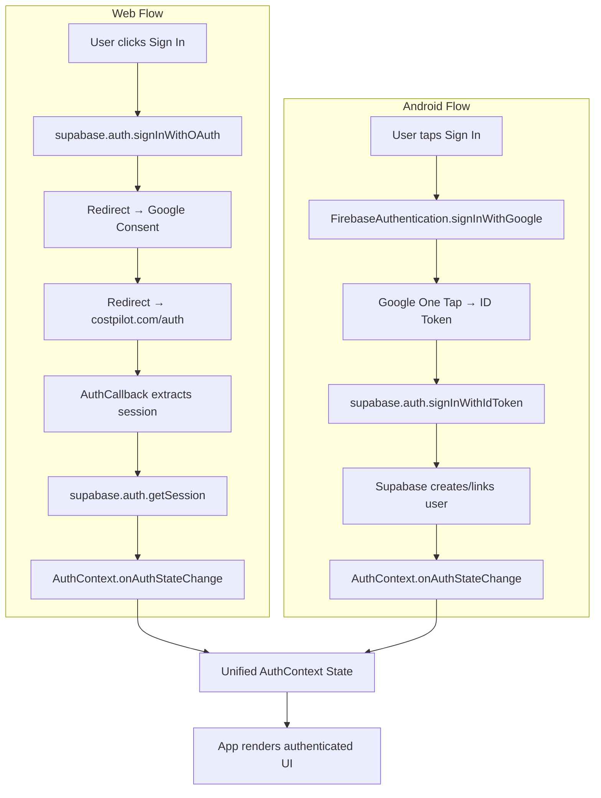

# CostPilot — Full System Architectural Decomposition

---

## Current State Assessment

The app works, but everything lives in a flat structure with no layering:

| Problem | Where |
|---------|-------|
| Monolithic state hub | [App.tsx](file:///home/apurbo/Projects/CostPilot/App.tsx) (403 lines) — routing, CRUD, state, view rendering |
| UI calls infrastructure directly | Components import `supabaseClient` and `LocalRepository` |
| Auth mixes platforms | [AuthContext.tsx](file:///home/apurbo/Projects/CostPilot/components/AuthContext.tsx) contains both web OAuth and Firebase native flows |
| No domain layer | Business logic scattered across components and services |
| No use-case orchestration | [CloudBackupContext.tsx](file:///home/apurbo/Projects/CostPilot/components/CloudBackupContext.tsx) directly manages sync lifecycle |
| Gemini never integrated | `@google/genai` in deps, `GEMINI_API_KEY` in Vite config, no usage |

---

## 1️⃣ Layered Architecture

### Dependency Rule

```
┌─────────────────────────────────────────────┐
│             Presentation Layer              │
│  (React components, pages, UI primitives)   │
└──────────────────┬──────────────────────────┘
                   │ calls
┌──────────────────▼──────────────────────────┐
│             Application Layer               │
│  (Use cases, orchestrators, contexts)       │
└──────────────────┬──────────────────────────┘
                   │ calls
┌──────────────────▼──────────────────────────┐
│              Domain Layer                   │
│  (Models, validation, financial calcs)      │
└──────────────────┬──────────────────────────┘
                   │ calls via interfaces
┌──────────────────▼──────────────────────────┐
│           Infrastructure Layer              │
│  (Supabase, localStorage, Gemini, APIs)     │
└─────────────────────────────────────────────┘
        ↑
┌───────┴─────────────────────────────────────┐
│        Mobile Integration Layer             │
│  (Capacitor, Firebase Auth, platform detect)│
└─────────────────────────────────────────────┘
```

> **Rule**: Dependencies point **downward only**. Infrastructure implements interfaces defined in Domain. Presentation never imports from Infrastructure.

### Layer Responsibilities

| Layer | Responsibility | Must NOT |
|-------|---------------|----------|
| **Presentation** | Render UI, capture user input, route navigation | Call Supabase, localStorage, or any API directly |
| **Application** | Orchestrate use cases, manage React contexts, coordinate sync | Contain rendering logic or raw SQL/API calls |
| **Domain** | Define models, validate data, compute financial summaries | Import React, Supabase, or platform APIs |
| **Infrastructure** | Implement data access, external API adapters, persistence | Contain business rules or UI logic |
| **Mobile** | Platform detection, native plugin adapters, Firebase auth bridge | Contain domain logic or universal UI |

---

## 2️⃣ Folder Structure

```
/src
├── app/                          # Bootstrap & routing
│   ├── App.tsx                   # Root component (thin — just providers + router)
│   ├── router.tsx                # Route definitions
│   └── providers.tsx             # AuthProvider, CloudBackupProvider, etc.
│
├── features/                     # Feature modules (vertical slices)
│   ├── dashboard/
│   │   └── Dashboard.tsx
│   ├── history/
│   │   ├── History.tsx
│   │   └── CalendarView.tsx
│   ├── analysis/
│   │   └── Analysis.tsx
│   ├── settings/
│   │   └── Settings.tsx
│   ├── categories/
│   │   ├── CategoryManagement.tsx
│   │   ├── CategoryPickerModal.tsx
│   │   └── CategoryEditorModal.tsx
│   ├── transactions/
│   │   └── NewEntryModal.tsx
│   ├── auth/
│   │   ├── LoginScreen.tsx
│   │   └── AuthCallback.tsx
│   └── static/
│       ├── Support.tsx
│       ├── PrivacyPolicy.tsx
│       └── TermsOfService.tsx
│
├── entities/                     # Domain layer
│   ├── transaction.ts            # Transaction model, validation
│   ├── category.ts               # Category model, defaults
│   ├── monthly-data.ts           # MonthlyData model
│   ├── types.ts                  # Shared domain types (View, etc.)
│   └── financial.ts              # formatCompactNumber, currency helpers
│
├── application/                  # Use cases & orchestration
│   ├── contexts/
│   │   ├── AuthContext.tsx        # Auth state management (platform-agnostic)
│   │   └── CloudBackupContext.tsx # Sync orchestration
│   ├── use-cases/
│   │   ├── manage-transactions.ts  # CRUD orchestration
│   │   ├── manage-categories.ts    # Category CRUD
│   │   ├── sync-data.ts            # Push/pull/reconcile
│   │   └── analyze-finances.ts     # Gemini AI orchestration
│   └── ports/                    # Interfaces (dependency inversion)
│       ├── auth-provider.ts
│       ├── data-repository.ts
│       ├── remote-sync.ts
│       └── ai-service.ts
│
├── infrastructure/               # External adapters
│   ├── supabase/
│   │   ├── client.ts             # createClient singleton
│   │   ├── supabase-sync.ts      # Implements RemoteSyncPort
│   │   └── supabase-profile.ts   # Profile CRUD via Supabase
│   ├── local/
│   │   └── local-repository.ts   # localStorage adapter
│   ├── gemini/
│   │   └── gemini-service.ts     # Implements AiServicePort
│   └── export/
│       └── pdf-csv-export.ts     # jsPDF + html2canvas logic
│
├── mobile/                       # Capacitor + Firebase adapters
│   ├── platform.ts               # isNative(), getPlatform()
│   ├── firebase-auth-adapter.ts  # Implements AuthProviderPort for Android
│   └── capacitor-plugins.ts      # SplashScreen, Share, Filesystem wrappers
│
├── shared/                       # Platform-agnostic UI primitives
│   ├── ui/
│   │   ├── DatePicker.tsx
│   │   ├── Dropdown.tsx
│   │   ├── ConfirmModal.tsx
│   │   ├── Toast.tsx
│   │   ├── AccountDeletionModal.tsx
│   │   └── SyncReconciliationModal.tsx
│   ├── Layout.tsx
│   ├── Footer.tsx
│   └── SplashScreen.tsx
│
├── constants.ts                  # Default categories, initial data
├── index.tsx                     # ReactDOM.createRoot entry
└── index.css                     # Global styles
```

### What Changes from Current Structure

| Current | Proposed | Why |
|---------|----------|-----|
| [App.tsx](file:///home/apurbo/Projects/CostPilot/App.tsx) (403 lines, does everything) | `app/App.tsx` (thin shell) + `application/use-cases/` | Separate orchestration from rendering |
| [types.ts](file:///home/apurbo/Projects/CostPilot/types.ts) in root | `entities/types.ts` + `entities/transaction.ts` | Domain models belong in domain layer |
| [services/supabaseClient.ts](file:///home/apurbo/Projects/CostPilot/services/supabaseClient.ts) imported everywhere | `infrastructure/supabase/client.ts`, accessed only through ports | Decouples UI from Supabase |
| [components/AuthContext.tsx](file:///home/apurbo/Projects/CostPilot/components/AuthContext.tsx) with platform checks | `application/contexts/AuthContext.tsx` + `mobile/firebase-auth-adapter.ts` | Isolate platform-specific code |
| [utils.ts](file:///home/apurbo/Projects/CostPilot/utils.ts) in root | `entities/financial.ts` | Domain-specific helpers belong in domain |
| `components/UI/` | `shared/ui/` | Clearer naming, separate from features |

---

## 3️⃣ TypeScript Interface Boundaries

### Auth Provider Port

```ts
// application/ports/auth-provider.ts

export interface AuthSession {
  userId: string;
  email: string;
  accessToken: string;
  refreshToken?: string;
  expiresAt?: number;
}

export interface AuthProviderPort {
  signIn(): Promise<AuthSession>;
  signOut(): Promise<void>;
  getSession(): Promise<AuthSession | null>;
  onAuthStateChange(
    callback: (event: 'SIGNED_IN' | 'SIGNED_OUT' | 'TOKEN_REFRESHED', session: AuthSession | null) => void
  ): () => void;
}
```

### Implementations

```ts
// infrastructure/supabase/web-auth-adapter.ts
import { supabase } from './client';
import type { AuthProviderPort, AuthSession } from '../../application/ports/auth-provider';

export class WebAuthProvider implements AuthProviderPort {
  async signIn(): Promise<AuthSession> {
    const { error } = await supabase!.auth.signInWithOAuth({
      provider: 'google',
      options: {
        redirectTo: `${import.meta.env.VITE_SITE_URL}/auth`,
        queryParams: { access_type: 'offline', prompt: 'consent' },
      },
    });
    if (error) throw error;
    // Session will be set via onAuthStateChange after redirect
    return this.getSession() as Promise<AuthSession>;
  }
  // ... signOut, getSession, onAuthStateChange wrapping supabase.auth
}
```

```ts
// mobile/firebase-auth-adapter.ts
import { FirebaseAuthentication } from '@capacitor-firebase/authentication';
import { supabase } from '../infrastructure/supabase/client';
import type { AuthProviderPort, AuthSession } from '../application/ports/auth-provider';

export class AndroidAuthProvider implements AuthProviderPort {
  async signIn(): Promise<AuthSession> {
    const result = await FirebaseAuthentication.signInWithGoogle();
    const idToken = result.credential?.idToken;
    if (!idToken) throw new Error('No ID token from Google Auth');

    const { data, error } = await supabase!.auth.signInWithIdToken({
      provider: 'google',
      token: idToken,
    });
    if (error) throw error;
    return {
      userId: data.user!.id,
      email: data.user!.email!,
      accessToken: data.session!.access_token,
      refreshToken: data.session!.refresh_token,
    };
  }
  // ... signOut (Firebase + Supabase), getSession, onAuthStateChange
}
```

### Data Repository Port

```ts
// application/ports/data-repository.ts

import type { Transaction, Category } from '../../entities/types';

export interface LocalExpense extends Transaction {
  user_id: string | null;
  created_at: string;
  updated_at: string;
  deleted: boolean;
  is_synced: boolean;
}

export interface DataRepositoryPort {
  // Transactions
  getAllTransactions(): LocalExpense[];
  upsertTransaction(tx: Omit<LocalExpense, 'updated_at' | 'created_at' | 'is_synced' | 'deleted'>): LocalExpense;
  deleteTransaction(id: string): void;
  getPendingSyncTransactions(): LocalExpense[];

  // Categories
  getAllCategories(): Category[];
  upsertCategory(cat: Category): void;

  // Settings
  getSettings(): Record<string, any>;
  updateSettings(updates: Record<string, any>): void;
}
```

### Remote Sync Port

```ts
// application/ports/remote-sync.ts

export interface SyncResult {
  success: boolean;
  itemsPushed: number;
  itemsPulled: number;
  conflicts: SyncConflict[];
}

export interface SyncConflict {
  id: string;
  localVersion: any;
  remoteVersion: any;
  type: 'transaction' | 'category';
}

export interface RemoteSyncPort {
  pushChanges(userId: string, pending: any[]): Promise<boolean>;
  pullChanges(userId: string): Promise<boolean>;
  getSyncDiff(userId: string): Promise<SyncConflict[]>;
  applyReconciliation(userId: string, actions: { id: string; action: string }[]): Promise<void>;
}
```

### AI Service Port

```ts
// application/ports/ai-service.ts

export interface FinancialInsight {
  summary: string;
  suggestions: string[];
  spendingPatterns: { category: string; trend: 'up' | 'down' | 'stable'; percent: number }[];
}

export interface AiServicePort {
  analyzeSpending(transactions: Transaction[], period: string): Promise<FinancialInsight>;
}
```

---

## 4️⃣ Authentication Architecture

### Flow Diagram



### Token Exchange Details

| Step | Web | Android |
|------|-----|---------|
| **1. Initiate** | `signInWithOAuth({ provider: 'google' })` | `FirebaseAuthentication.signInWithGoogle()` |
| **2. Credential** | Supabase handles OAuth callback internally | Firebase returns `credential.idToken` |
| **3. Exchange** | Automatic (Supabase manages the session) | `signInWithIdToken({ provider: 'google', token: idToken })` |
| **4. Session** | `supabase.auth.getSession()` returns JWT | Same — Supabase creates a session from the ID token |
| **5. Storage** | Supabase JS SDK auto-persists in `localStorage` | Same — Supabase JS SDK handles it |
| **6. Refresh** | `onAuthStateChange` detects `TOKEN_REFRESHED` | Same |

### Where Things Live

- **`AuthContext`** → `application/contexts/AuthContext.tsx` — platform-agnostic, receives an `AuthProviderPort`
- **`WebAuthProvider`** → `infrastructure/supabase/web-auth-adapter.ts`
- **`AndroidAuthProvider`** → `mobile/firebase-auth-adapter.ts`
- **Provider selection** → `app/providers.tsx` using `Capacitor.isNativePlatform()` to pick the right adapter at bootstrap

### Avoiding Duplication

Currently `AuthContext.tsx` has an inline `if (Capacitor.isNativePlatform())` branch. The fix:

```ts
// app/providers.tsx
import { isNative } from '../mobile/platform';
import { WebAuthProvider } from '../infrastructure/supabase/web-auth-adapter';
import { AndroidAuthProvider } from '../mobile/firebase-auth-adapter';

const authProvider = isNative() ? new AndroidAuthProvider() : new WebAuthProvider();

// Pass into AuthContext as a prop or via module injection
```

This ensures the platform branching happens **once** at the app root, not scattered through components.

---

## 5️⃣ State & Sync Strategy

### Local-First Model

CostPilot already uses a local-first model via `LocalRepository` (localStorage-backed). The proposed architecture keeps this but makes it cleaner:

```
┌─────────────────────────────────────────────────┐
│  User Action (add/edit/delete transaction)       │
└──────────────────┬──────────────────────────────┘
                   │
                   ▼
┌──────────────────────────────────────────────────┐
│  Use Case: manage-transactions.ts                │
│  1. Validate via domain model                    │
│  2. Write to LocalRepository (is_synced: false)  │
│  3. Update React state (optimistic)              │
│  4. Queue sync if cloud enabled                  │
└──────────────────┬──────────────────────────────┘
                   │
                   ▼
┌──────────────────────────────────────────────────┐
│  Sync Queue (sync-data.ts)                       │
│  1. Collect pending items (is_synced: false)      │
│  2. Push to Supabase (upsert with user_id)       │
│  3. Mark items as is_synced: true                │
│  4. Pull remote changes                          │
│  5. Reconcile conflicts via updated_at           │
└──────────────────┬──────────────────────────────┘
                   │
                   ▼
┌──────────────────────────────────────────────────┐
│  Supabase (remote source of truth)               │
│  - RLS enforces user_id ownership                │
│  - Realtime subscription for cross-device sync   │
└──────────────────────────────────────────────────┘
```

### Conflict Resolution
The current codebase uses `updated_at` comparison — this is correct for the scale:

1. **Last-write-wins** for simple fields
2. **Soft deletes** with `deleted: true` flag, synced to remote
3. **Reconciliation modal** (`SyncReconciliationModal.tsx`) for conflicts where both sides changed — this is already built and works well

### Sync Lifecycle

```
App Boot
  │
  ├─ Not signed in → Local-only mode (no sync)
  │
  └─ Signed in + cloud enabled
       │
       ├─ Local DB empty? → Full pull from Supabase
       │
       └─ Local DB has data
            │
            ├─ Push pending changes (is_synced: false)
            │
            ├─ Pull remote updates
            │
            └─ Diff detected?
                 ├─ No conflicts → Auto-merge
                 └─ Conflicts → Show SyncReconciliationModal
```

### What to Improve

| Current Issue | Fix |
|---------------|-----|
| Sync guard uses module-level `isSyncing` boolean | Move to a proper sync state machine in `sync-data.ts` |
| 30s timeout as "safety net" | Add exponential backoff + retry |
| `CloudBackupContext` is 275 lines | Split into `CloudBackupContext` (thin) + `sync-data.ts` use case |
| No offline queue persistence | Pending items already persist in localStorage (they have `is_synced: false`) — this is fine |

---

## 6️⃣ Build & Bundling Optimization

### Current Chunking Strategy (already good)

The existing `vite.config.ts` manual chunking is well-structured:

| Chunk | Contents | Size Impact |
|-------|----------|-------------|
| `vendor-core` | react, react-dom, scheduler | ~45KB gzip |
| `vendor-cloud` | supabase, firebase, capacitor | ~120KB gzip |
| `vendor-ui` | recharts, d3 | ~80KB gzip |
| `vendor-export` | jspdf, html2canvas | ~100KB gzip |

### What to Improve

#### Route-Level Code Splitting
```ts
// app/router.tsx
const Dashboard = lazy(() => import('../features/dashboard/Dashboard'));
const History = lazy(() => import('../features/history/History'));
const Analysis = lazy(() => import('../features/analysis/Analysis'));
const Settings = lazy(() => import('../features/settings/Settings'));
```

Currently `App.tsx` directly imports all views. Lazy loading them reduces the initial bundle.

#### Lazy-Load Targets (Highest Impact)

| Module | Why Lazy | Trigger |
|--------|----------|---------|
| `Analysis.tsx` + recharts | Charts not needed on first load | User navigates to Analysis |
| `Settings.tsx` + jspdf/html2canvas | PDF/CSV export is rare | User navigates to Settings → Export |
| `SyncReconciliationModal.tsx` | Only shown during sync conflicts | Conflict detected |
| `gemini-service.ts` (future) | AI not needed until user requests insights | User triggers "Analyze" |

#### WebView Cold Start Optimization

1. **Inline critical CSS** — Vite can be configured to inline CSS under 4KB
2. **Preload vendor-core** — Add `<link rel="modulepreload">` for the React chunk
3. **Defer vendor-cloud** — Firebase + Supabase can initialize after first paint
4. **Service worker** — Cache static assets for instant subsequent loads on Android

#### Practical Vite Config Additions

```ts
build: {
  target: 'es2020',      // WebView supports this
  cssCodeSplit: true,     // Per-route CSS
  reportCompressedSize: true,
  rollupOptions: {
    output: {
      manualChunks(id) {
        // ... existing chunking ...
        // Add: Gemini SDK as separate chunk
        if (id.includes('@google/genai')) return 'vendor-ai';
      }
    }
  }
}
```

---

## 7️⃣ Security Audit

### Risk Matrix

| Asset | Current State | Risk Level | Action Required |
|-------|--------------|------------|-----------------|
| **Supabase Anon Key** | Exposed in `.env`, embedded in client bundle | 🟡 Medium | Acceptable **only if RLS is enforced** on every table |
| **Gemini API Key** | In `.env` as `GEMINI_API_KEY`, injected via Vite `define` | 🔴 High | **Never expose to client**. Move to serverless function |
| **Firebase Config** | `google-services.json` in repo root | 🟡 Medium | Acceptable for Android — restricted by SHA-1 signing |
| **Supabase URL** | Exposed in `.env` | 🟢 Low | Public by design |
| **`.env` in repo** | Committed to git | 🔴 High | Add to `.gitignore` immediately |

### Concrete Corrections

#### 1. Gemini API Key — MUST Move Server-Side

> [!CAUTION]
> The Gemini API key is currently injected into the client bundle via `process.env.GEMINI_API_KEY`. Anyone can extract it from the browser's JS source. This is the highest-priority security fix.

**Solution**: Create a Vercel Edge Function or Supabase Edge Function:

```ts
// Option A: Vercel API Route (/api/analyze.ts)
export default async function handler(req, res) {
  const { transactions, period } = req.body;
  // Validate Supabase JWT from Authorization header
  const user = await verifySupabaseJWT(req.headers.authorization);
  if (!user) return res.status(401).json({ error: 'Unauthorized' });

  const genai = new GoogleGenAI({ apiKey: process.env.GEMINI_API_KEY });
  const result = await genai.models.generateContent(/* ... */);
  return res.json(result);
}
```

```ts
// Option B: Supabase Edge Function (recommended — stays in Supabase ecosystem)
Deno.serve(async (req) => {
  const authHeader = req.headers.get('Authorization');
  // Verify JWT, call Gemini, return result
});
```

**Recommendation**: Use **Supabase Edge Functions** — they run close to the database, can read RLS context, and keep the infrastructure unified.

#### 2. Row-Level Security (RLS) Checklist

Verify these RLS policies exist on **every** table:

```sql
-- transactions table
CREATE POLICY "Users can only access own transactions"
  ON transactions FOR ALL
  USING (auth.uid() = user_id);

-- categories table
CREATE POLICY "Users can only access own categories"
  ON categories FOR ALL
  USING (auth.uid() = user_id);

-- profiles table
CREATE POLICY "Users can only access own profile"
  ON profiles FOR ALL
  USING (auth.uid() = id);
```

> [!IMPORTANT]
> Without RLS, the anon key allows **any authenticated user** to read/modify **any** row. This is the single most important security control.

#### 3. `.env` in Git

The `.env` file is currently tracked. Add to `.gitignore`:

```
.env
.env.local
.env.production
```

If already committed, rotate all keys:
- Supabase anon key (regenerate in Supabase dashboard)
- Gemini API key (regenerate in Google Cloud console)

#### 4. CORS Configuration

Supabase handles CORS automatically for its APIs. For any custom Vercel/Edge Functions, set:

```ts
headers: {
  'Access-Control-Allow-Origin': 'https://costpilot.com',
  'Access-Control-Allow-Methods': 'POST',
  'Access-Control-Allow-Headers': 'Authorization, Content-Type',
}
```

#### 5. XSS in WebView

- React already escapes JSX by default — low risk
- **Audit any `dangerouslySetInnerHTML` usage** — none found in the current codebase ✅
- **Capacitor WebView**: Disable `allowFileAccess` and `allowContentAccess` in Android config if not needed

#### 6. Replay Attack Mitigation

- Supabase JWTs have a short expiry (1 hour default) + auto-refresh — acceptable
- For the Gemini proxy endpoint, add request signing or rate limiting per user

### Security Checklist

- [ ] **Move Gemini API key to server-side** (Supabase Edge Function or Vercel API route)
- [ ] **Verify RLS policies** on `transactions`, `categories`, `profiles` tables
- [ ] **Add `.env` to `.gitignore`** and rotate all committed secrets
- [ ] **Remove `google-services.json` from git** (use build-time injection instead)
- [ ] **Set CORS** to only allow `costpilot.com` on any serverless endpoints
- [ ] **Rate-limit the AI proxy** endpoint (e.g., 10 requests/min/user)
- [ ] **Audit WebView permissions** (`allowFileAccess`, `allowContentAccess`)

---

## 2️⃣ API & Backend Boundary Clarification

### Should Gemini Be Called Directly From Frontend?

**No.** Three reasons:

1. **API key exposure** — Client JS can be decompiled trivially
2. **Cost control** — No rate limiting means a bad actor can rack up Gemini bills
3. **Input sanitization** — Server-side proxy can validate/sanitize transaction data before sending to Gemini

### Recommended Architecture: Supabase + Supabase Edge Function for AI

```
┌─────────────┐     ┌──────────────────┐     ┌─────────────┐
│  React App  │────→│ Supabase Edge Fn │────→│  Gemini API │
│  (client)   │  ←──│  /analyze        │  ←──│  (Google)   │
└─────────────┘     └────────┬─────────┘     └─────────────┘
                             │
                    ┌────────▼─────────┐
                    │  Supabase DB     │
                    │  (read user txns)│
                    └──────────────────┘
```

**Why not a full backend?** At 1–5k users, Supabase + Edge Functions handles everything. Adding a separate backend server would be overengineering.

### Supabase RPC: Use Where It Makes Sense

Use Supabase RPC (PostgreSQL functions) for:
- **Aggregations** — Monthly totals, category summaries (faster than pulling all rows)
- **Batch operations** — Bulk upserts during sync (atomic)

Don't use RPC for:
- Simple CRUD — The Supabase client already generates efficient queries
- Complex business logic — Keep in the TypeScript application layer

---

## 3️⃣ Mobile vs Web Separation

### What Belongs in `/mobile`

| Module | Purpose |
|--------|---------|
| `platform.ts` | `isNative()`, `getPlatform()` — single source of platform truth |
| `firebase-auth-adapter.ts` | Android Google Sign-In via Firebase → Supabase token exchange |
| `capacitor-plugins.ts` | Wrappers for SplashScreen, Share, Filesystem |

### What Must Stay Platform-Agnostic

| Module | Reason |
|--------|--------|
| `entities/*` | Domain models shared across all platforms |
| `application/use-cases/*` | Business logic independent of platform |
| `shared/ui/*` | UI components render in both web browser and WebView |
| `application/contexts/*` | Contexts consume adapters via ports — no platform knowledge |

### Adapter Pattern (Already Shown in §3)

```ts
// application/ports/auth-provider.ts
interface AuthProviderPort {
  signIn(): Promise<AuthSession>;
  signOut(): Promise<void>;
  // ...
}

// infrastructure/supabase/web-auth-adapter.ts
class WebAuthProvider implements AuthProviderPort { /* ... */ }

// mobile/firebase-auth-adapter.ts
class AndroidAuthProvider implements AuthProviderPort { /* ... */ }
```

The consuming code (`AuthContext`) never knows which provider it's using:

```ts
// application/contexts/AuthContext.tsx
export const AuthProvider: React.FC<{ adapter: AuthProviderPort; children: ReactNode }> = ({ adapter, children }) => {
  const signIn = () => adapter.signIn();
  // No platform checks anywhere in this file
};
```

---

## Summary of Deliverables

| # | Deliverable | Section |
|---|-------------|---------|
| 1 | Layered architecture diagram | §1 |
| 2 | Folder structure tree | §2 |
| 3 | TypeScript interface boundaries | §3 |
| 4 | Authentication flow diagram | §4 |
| 5 | Sync lifecycle flow | §5 |
| 6 | Security checklist | §7 |
| 7 | Build optimization strategy | §6 |
